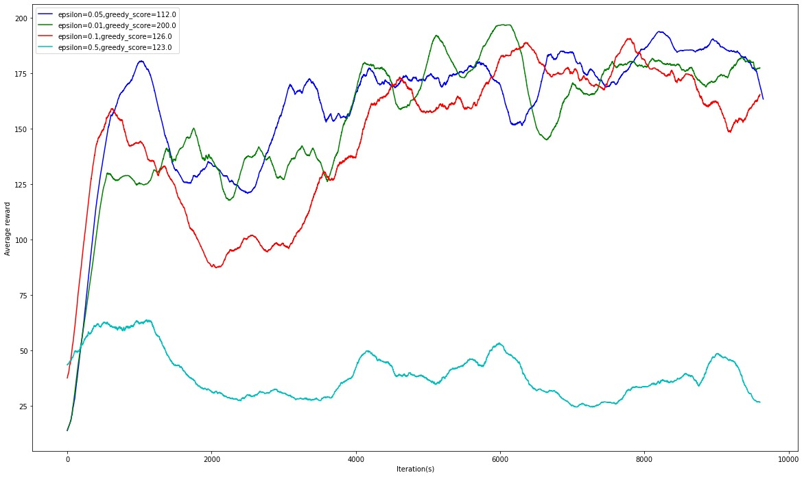

# Introduction
Basic Reinforcement Learning: Deep Q Network on CartPole problem (OpenAI Gym)  
Understand the trade-off between exploitation and exploration with ε-policy

# Reinforcement learning
 - ε-policy
 - Bellman equation
 - Deep Q networks (2 hidden layers)
 - Replay buffer

# Environments
## Train
Use Google Colab (with GPU enabled) to train neural networks (`CartPole.ipynb`)

## Test
Ubuntu 22.04 LTS  
python 3.8.0  
pytorch 1.11.0  

`python main.py`

Folder `pretrained_models` contains pretrained models with different epsilons (0.01, 0.05, 0.1, 0.5) after over 10000 iterations

# Results
Average reward (moving average with window=500) for different epsilons after 10000 iterations

- Greedy test: Model trained with ε=0.01

- Greedy test: Model trained with ε=0.05

- Greedy test: Model trained with ε=0.1

- Greedy test: Model trained with ε=0.5

# References
The code is based on https://github.com/seungeunrho/minimalRL/blob/master/dqn.py